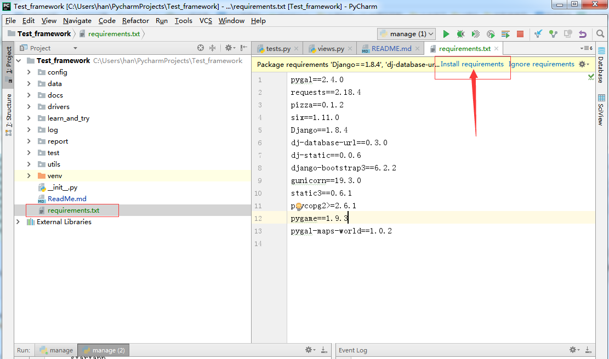
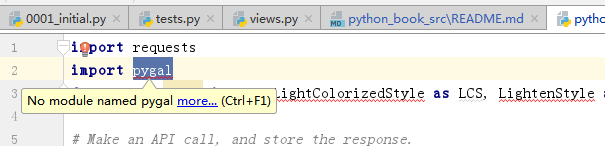
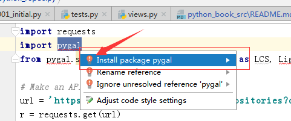
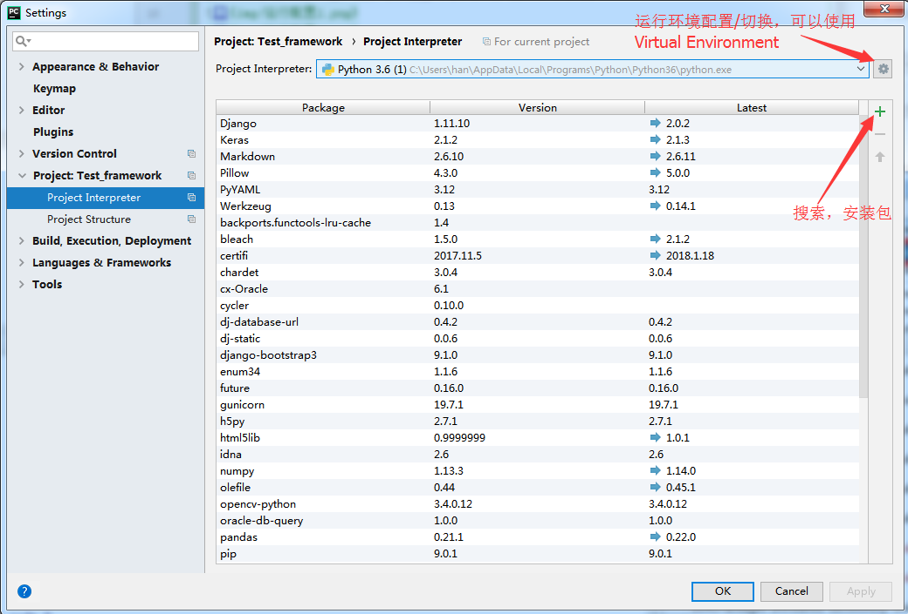
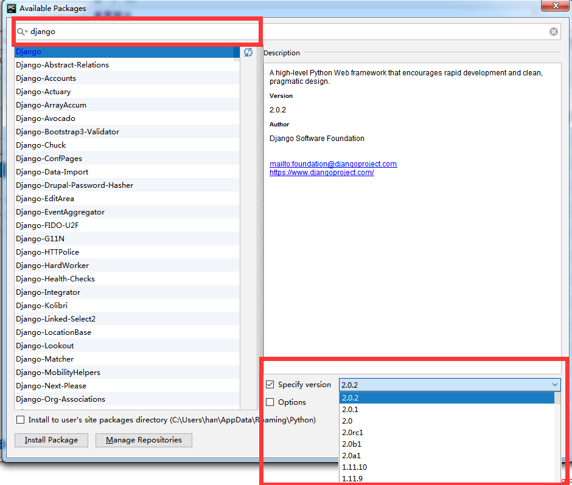
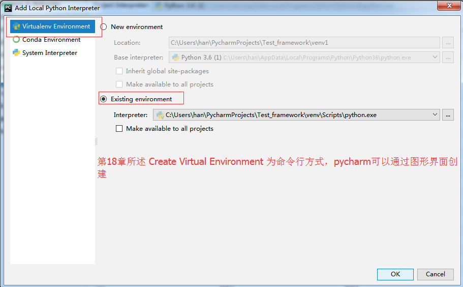
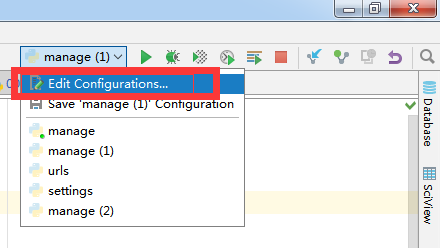
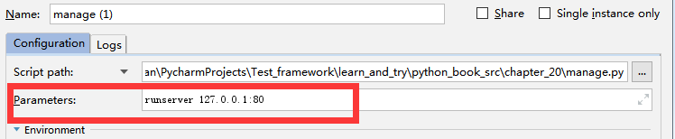

Python Crash Course（Python编程：从入门到实践）
-------

===
- [最初版本源代码](https://github.com/ehmatthes/pcc) 

A Hands-On, Project-Based Introduction to Programming
---

This is a collection of resources for [Python Crash Course](http://www.nostarch.com/pythoncrashcourse/), an introductory programming book from [No Starch Press](http://www.nostarch.com) by Eric Matthes. Click here for a [much cleaner version](https://ehmatthes.github.io/pcc/) of these online resources.

If you have any questions about Python Crash Course, feel free to get in touch:

Email: ehmatthes@gmail.com

Twitter: [@ehmatthes](http://twitter.com/ehmatthes/)

Setup Instructions
---
Here you can find instructions for:

- [Installing and configuring Python](http://ehmatthes.github.io/pcc/chapter_01/README.html) (Chapter 1)
- [Installing and using pip](http://ehmatthes.github.io/pcc/chapter_12/installing_pip.html) (Chapter 12)
- [Installing Pygame](http://ehmatthes.github.io/pcc/chapter_12/README.html) (Chapter 12)
- [Installing matplotlib and Pygal](http://ehmatthes.github.io/pcc/chapter_15/README.html) (Chapter 15)
- [Creating a Virtual Environment](http://ehmatthes.github.io/pcc/chapter_18/README.html) (Chapter 18)
- [Deploying a Project to Heroku](http://ehmatthes.github.io/pcc/chapter_20/README.html) (Chapter 20)
- [Installing Python](http://ehmatthes.github.io/pcc/appendix_a/README.html) (Appendix A)

Downloading source code
---
The simplest way to get the online resources for the book is to click on the [*Download ZIP*](https://github.com/ehmatthes/pcc/archive/master.zip) button on the upper right side of [this page](https://github.com/ehmatthes/pcc), which will download the source code files (and other resources) for the entire book.

[Cheat Sheets](http://ehmatthes.github.io/pcc/cheatsheets/README.html)
---

Cheat sheets can be really helpful when you're working on a set of programming exercises or a project. This set of [cheat sheets](http://ehmatthes.github.io/pcc/cheatsheets/README.html) will help remind you of the concepts you're learning, as well as the Python syntax for these concepts.

[Updates](http://ehmatthes.github.io/pcc/updates.html)
---

Some of the libraries featured in the book have been updated recently, which is a good thing - it means you're learning to use Python packages that are steadily being improved.

When packages are updated you have the option of using the version that was featured in the book, which lets you run code exactly as it's written in the book. You can also choose to install the latest version of each package, and modify the code in the book slightly. Each approach is outlined clearly in these updates.

A list of updates is kept [here](http://ehmatthes.github.io/pcc/updates.html).

使用pycharm进行包管理
===
- 自动安装包
打开 requirements.txt，点击install

- 半自动安装 alt+enter

- 手动安装

python库管理

手动搜索安装包以及版本选择

Virtual Environment

python文件之间的引用
===
- 1 可以使用绝对路径(推荐使用)

例如chapter_14/alien_invasion中：

        from learn_and_try.python_book_src.chapter_14.settings import Settings
        ...
- 2 可以使用相对路径

例如chapter_18/learning_logs/admin.py中：

        from .models import Topic, Entry
        ...  
        #.表示本层目录
        #./表示上层目录      

重要提示
---
18-20主要讲述搭建web服务器，是否创建Virtual Environment，不影响搭建web服务器.

pycharm启动web服务器，需要增加配置例如：runserver 127.0.0.1:80

learning_logs/urls.py（url路由配置文件）
适用于Django 1.X版本，与十二月 2, 2017发布的Django 2.0配置有差异，如果版本不匹配无法运行 

如果报错no such table: ***,
请找到对应的manage.py 使用命令行创建默认库 

    python manage.py migrate        